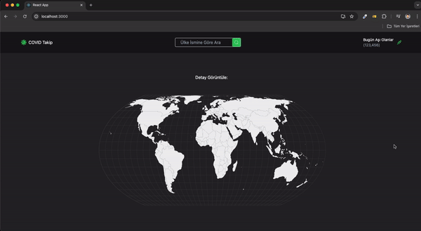

<h1>Corona-CovidMap<h1>

<h2>Api ile birlikte Günlük Vaka ,Aşı,Ölüm oranını gösteren ve Uniq-test ile kontrolü yapılan bir CovidMap sayfası yapılmıştır.</h2>

<h3>Corona-CovidMap<h3>

# Kütüphaneler

- react-router-dom
- react-icons
- tailwind
- react-simple-maps
- @reduxjs/toolkit
- react-redux
- @testing-library/user-event@14.0
- axios@^0.27.2
- react-testing-library
- jest

# GEO URL

- https://ismailarilik.com/react-covid-maps/geo.json

# Kaynaklar

- 1.API (Covid 19 Verisi): https://rapidapi.com/axisbits-axisbits-default/api/covid-19-statistics

- 2.API (Ülke Bilgileri): https://restcountries.com/v3.1/name/TUR
